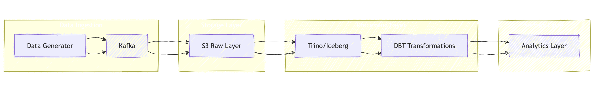

# Design Document for Retail Data Batch Processing Pipeline

## 1. Architecture Overview

### 1.1 High-Level Architecture
The system implements a modern data lakehouse architecture using the following components:



### Component Details

1. **Data Ingestion Layer**
   - Data Generator: Produces user events and product metadata
   - Kafka: Message broker handling two topics
     - user-events: Real-time user interaction events
     - product-metadata: Product catalog updates

2. **Storage Layer**
   - S3: Raw data lake storage
   - Kafka Connect S3 Sink: Streams data from Kafka to S3
   - Data Organization:
     ```
     s3://retail-data/
     ├── raw-data/
     │   ├── user-events/
     │   └── product-metadata/
     ├── warehouse/
     │   ├── staging/
     │   └── marts/
     ```

3. **Processing Layer**
   - Trino: SQL query engine for data processing
   - Iceberg: Table format providing ACID transactions
   - DBT: Data transformation tool

4. **Serving Layer**
   - Analytics-ready tables for business intelligence
   - Three main mart tables:
     - Product Category Revenue
     - Top Viewed Products
     - Same Day Purchasers

## Technology Choices

### Message Broker: Apache Kafka
- Chosen for:
  - High throughput event handling
  - Fault tolerance and durability
  - Topic partitioning for scalability
  - Event replay capabilities

### Storage: S3 + Apache Iceberg
- S3 chosen for:
  - Cost-effective scalable storage
  - High durability and availability
  - Integration with AWS services
- Iceberg chosen for:
  - ACID transactions
  - Schema evolution
  - Time travel capabilities
  - Partition evolution

### Processing: Trino + DBT
- Trino chosen for:
  - Fast distributed SQL queries
  - Multiple data source support
  - Scale-out architecture
- DBT chosen for:
  - Version controlled transformations
  - Built-in testing framework
  - Documentation generation
  - Modular transformation approach

## Scalability and Performance Considerations

### Data Volume Handling
1. **Kafka Scaling**
   - Topic partitioning based on user_id and product_id
   - Configurable retention period
   - Consumer group scaling

2. **Storage Optimization**
   - Iceberg table partitioning:
     ```sql
     -- Example partitioning for user events
     PARTITION BY date_trunc('day', event_timestamp)
     ```
   - S3 path partitioning for raw data

3. **Query Performance**
   - Materialized views for frequent queries
   - Iceberg metadata for efficient pruning
   - Trino worker scaling based on load

### Performance Optimizations
```sql
-- Example of optimized staging table
CREATE TABLE stg_user_events (
    event_id STRING,
    user_id STRING,
    product_id STRING,
    event_type STRING,
    event_timestamp TIMESTAMP
)
USING iceberg
PARTITIONED BY (days(event_timestamp))
CLUSTERED BY (user_id) INTO 4 BUCKETS
```

## Error Handling

### Data Quality Checks
1. **DBT Tests**
   - Schema validation
   - Referential integrity
   - Business logic validation
   - Custom data quality tests

2. **Pipeline Validation**
   ```sql
   -- Example of a data quality test
   
   SELECT *
   FROM {{ model }}
   WHERE event_type = 'purchase'
     AND (event_data:price IS NULL
          OR event_data:quantity IS NULL)
   
   ```

3. **Error Recovery**
   - Failed record isolation
   - Retry mechanisms
   - Dead letter queues for invalid messages

## Monitoring and Maintenance

### Monitoring Setup
1. **Metrics Collection**
   - Pipeline latency
   - Data freshness
   - Error rates
   - Processing times
   - Storage usage

2. **Alerting**
   - Data freshness SLAs
   - Error rate thresholds
   - Resource utilization alerts

3. **Logging**
   ```python
   # Example logging configuration
   logging.config.dictConfig({
       'version': 1,
       'handlers': {
           'console': {
               'class': 'logging.StreamHandler',
               'formatter': 'json'
           }
       },
       'root': {
           'handlers': ['console'],
           'level': 'INFO'
       }
   })
   ```

### Maintenance Procedures
1. **Regular Tasks**
   - Iceberg table maintenance
   - S3 lifecycle policies
   - Kafka log retention
   - Performance optimization

2. **Backup and Recovery**
   - S3 versioning
   - Iceberg snapshots
   - Configuration backups

3. **Update Procedures**
   - Schema evolution process
   - Pipeline version updates
   - Infrastructure updates

## Future Considerations

1. **Potential Enhancements**
   - Real-time aggregations
   - Machine learning feature store
   - Advanced analytics capabilities

2. **Scale-out Strategy**
   - Multi-region deployment
   - Cross-region replication
   - Global table federation

3. **Integration Points**
   - BI tool connections
   - API development
   - External system integration